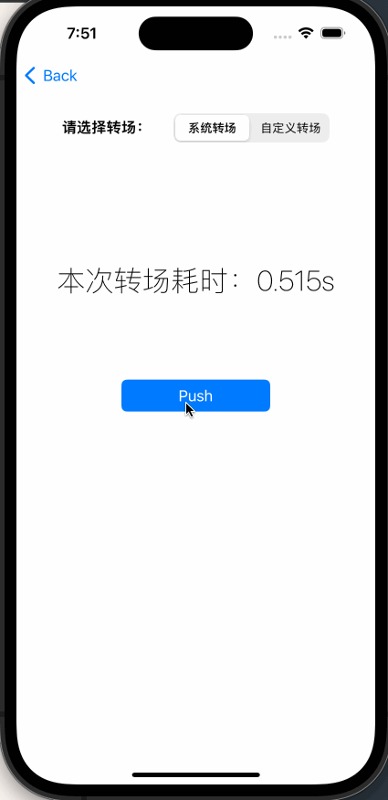
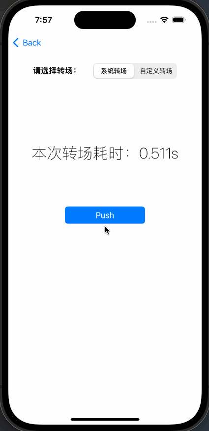
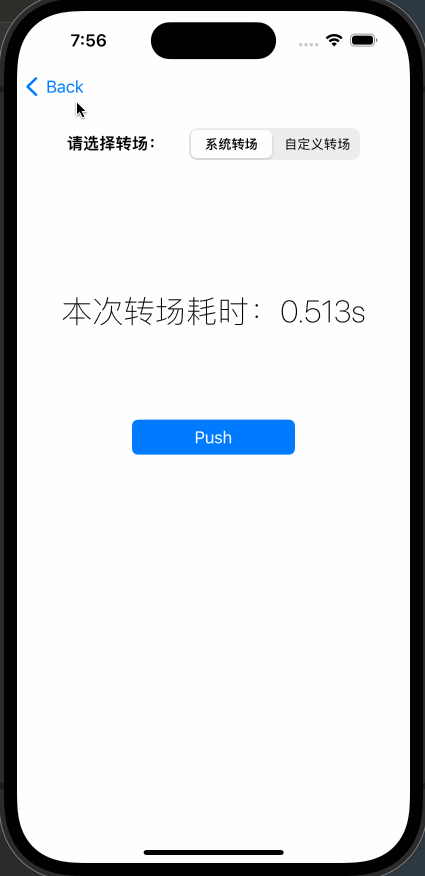
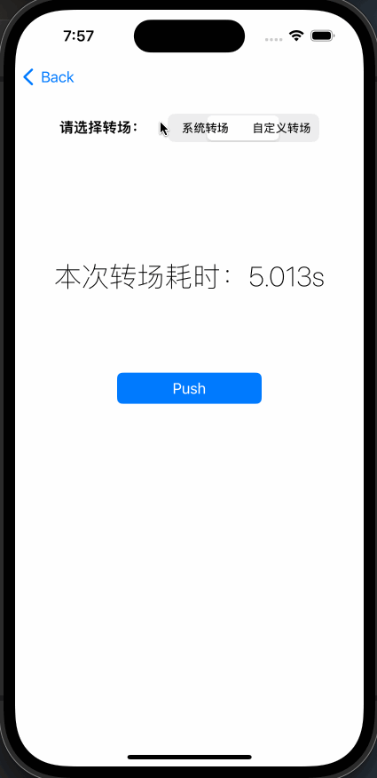

模仿系统转场效果（为了控制转场时间）

### 效果预览

push效果对比



慢动作



pop效果对比



慢动作



### 使用方式

已经封装好接口在导航控制器分类中，只需要

```objective-c
#import "UINavigationController+AZPushPopTransition.h"
```

然后在 push 时调用一行代码即可（push 加速了的页面，pop 同页面自动加速）

```objective-c
[self.navigationController pushViewControllerFast:vc animated:YES];
```

如果需要全局替换，也可以直接通过 swizzle 替换系统导航栏的`pushViewController:animated:`方法

默认速度为 0.2s，如果需要修改，可以去`AZPushPopTransition.m`中修改`kTransTime`的值。

